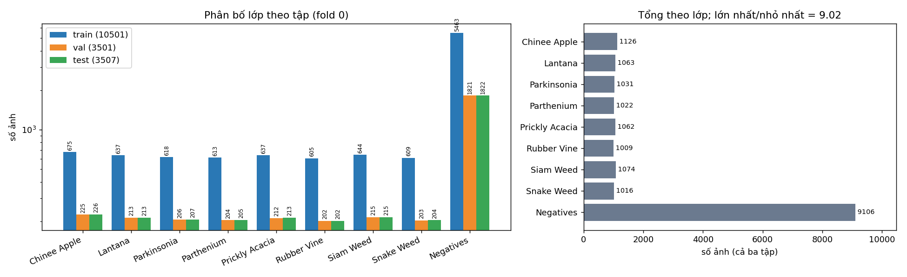
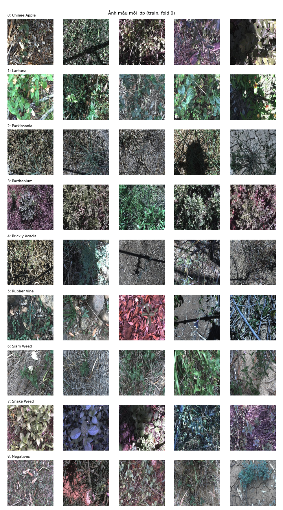
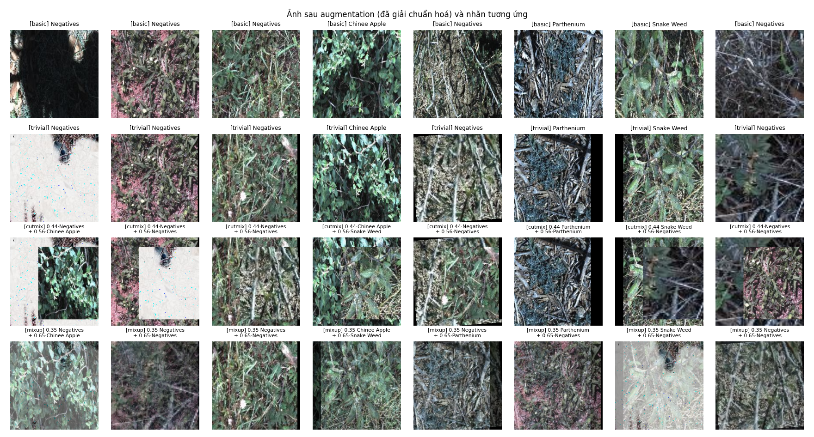
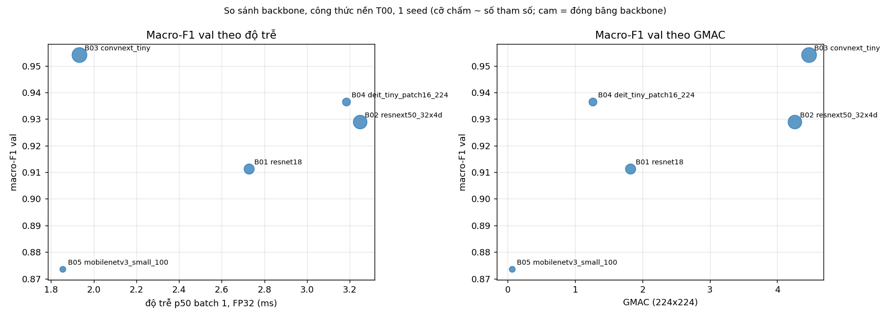
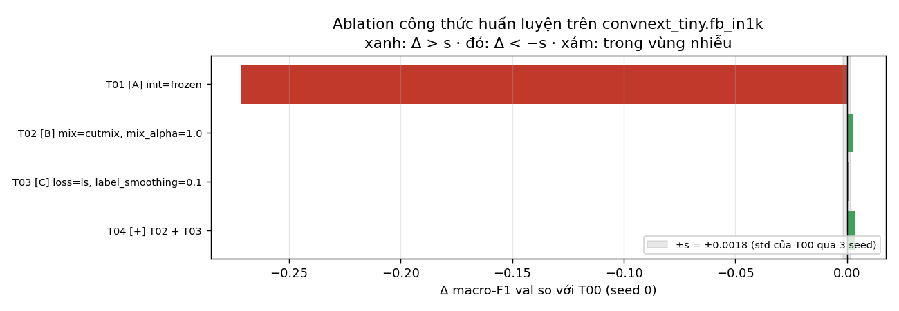
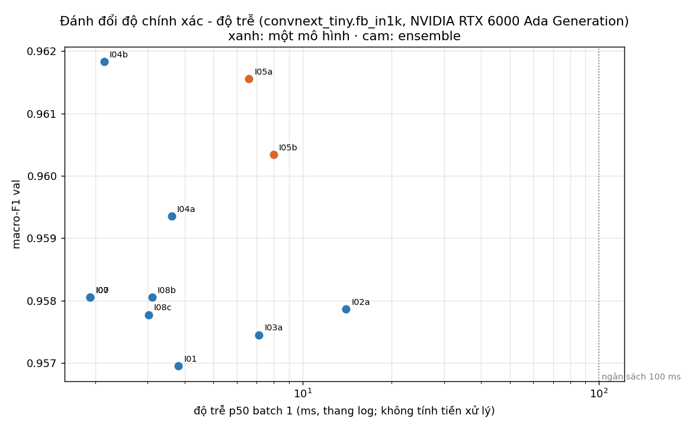
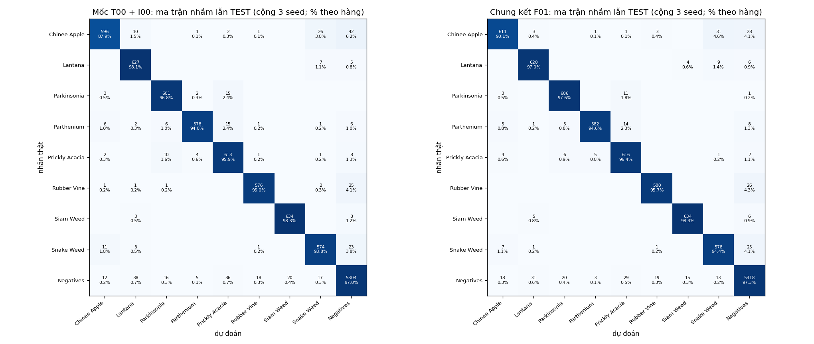
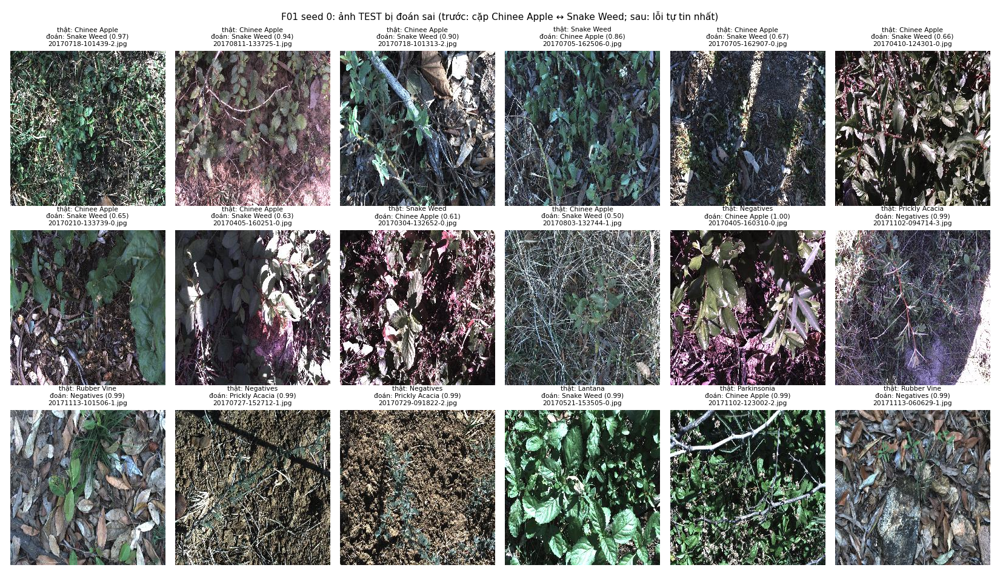

# Báo cáo Lab Day 2 — Backbone, công thức huấn luyện và suy luận trên DeepWeeds

**Sinh viên:** Nguyen Tuan Thanh · **MSSV:** 2A202602640 · Track 4, Ngày 2

> Mọi con số trong báo cáo lấy từ `results.xlsx` (sinh từ `logs/` và từ `eval.py` gốc chạy trên `predictions/`). Số ghi *trích dẫn* là của bài báo gốc hoặc bảng kết quả timm, không phải kết quả của bài này.

## 1. Tóm tắt

- **Bài toán:** phân loại 9 lớp DeepWeeds (17.509 ảnh 256×256, `Negative` chiếm khoảng 52%), fold 0 chia sẵn, chỉ số chính macro-F1.
- **Đã làm:** 5 backbone cùng công thức nền (1 seed); 3 thí nghiệm một-yếu-tố trên 3 trục + 1 kết hợp trên `convnext_tiny.fb_in1k`; 10 cấu hình suy luận ngoài mốc 1-view, có đo độ trễ p50/p95/p99; chung kết và mốc mỗi bên 3 seed. Tổng 15 bản ghi thí nghiệm: 13 lượt huấn luyện thực và 2 bản ghi tái sử dụng đúng cấu hình/seed.
- **Cấu hình tốt nhất (F01):** `convnext_tiny.fb_in1k` + công thức `T04` (T02 + T03) + suy luận I04b (Độ phân giải kiểm tra 256 (resize toàn ảnh, 1 view)) + temperature scaling.
- **Kết quả test (3 seed, test chạy một lần mỗi seed):** macro-F1 **0.9541 ± 0.0027**, top-1 **0.9643 ± 0.0022**, ECE 0.0089 ± 0.0009.
- **So với mốc T00 + I00:** macro-F1 test 0.9486 ± 0.0026; Δ = +0.0055, std lớn hơn của hai nhóm s = 0.0027 → chênh lệch **vượt nhiễu**.
- **Hai lớp khó (recall test):** Chinee Apple 90.1%, Snake Weed 94.4% (trích dẫn bài báo: 88.5% và 88.8%).
- **Thời gian thực:** F02 (cùng mô hình, 1 view, FP32) có p95 batch-1 = 1.9 ms trên NVIDIA RTX 6000 Ada Generation (đạt ngân sách 100 ms), macro-F1 test 0.9509 ± 0.0014.

## 2. Dữ liệu và thiết lập

**Ngân sách:** cấu hình 12 epoch, batch 64; hạn nộp ngắn nên ưu tiên đủ thiết kế thí nghiệm. Số epoch nằm trong mức 10–15 đề xuất. Các lần có cấu hình và seed giống hệt được tái sử dụng, ghi `reused_from` trong log, không coi là seed độc lập.

**Dataset và cách chia.** DeepWeeds (Olsen et al., 2019), fold 0 của tác giả, tải nguyên bản, không sửa/lọc/chia lại (S1). Kết quả kiểm tra của `dataset.check_split` (`logs/step0_data.json`):

- Số ảnh: train **10501** / val **3501** / test **3507** (59.97% / 20.00% / 20.03%), tổng 17509.
- Giao theo tên file: train∩val = 0, train∩test = 0, val∩test = 0; hợp ba tập = **17509** ảnh; file thiếu trong thư mục ảnh: 0.
- Định dạng ảnh: {'256x256 RGB': 17509} → mọi ảnh là RGB 256×256, nên val/test chỉ cần `CenterCrop(224)` và chuẩn hoá ImageNet.

| lớp | train | val | test | tổng (đếm thật) | Table 1 bài báo (trích dẫn) |
|---|---|---|---|---|---|
| Chinee Apple | 675 | 225 | 226 | 1126 | 1125 |
| Lantana | 637 | 213 | 213 | 1063 | 1064 |
| Parkinsonia | 618 | 206 | 207 | 1031 | 1031 |
| Parthenium | 613 | 204 | 205 | 1022 | 1022 |
| Prickly Acacia | 637 | 212 | 213 | 1062 | 1062 |
| Rubber Vine | 605 | 202 | 202 | 1009 | 1009 |
| Siam Weed | 644 | 215 | 215 | 1074 | 1074 |
| Snake Weed | 609 | 203 | 204 | 1016 | 1016 |
| Negatives | 5463 | 1821 | 1822 | 9106 | 9106 |

Số đếm theo lớp **lệch** Table 1 của bài báo ở: Chinee Apple 1126 (bài báo 1125); Lantana 1063 (bài báo 1064). Nguyên nhân tìm được: ảnh `20170714-110407-3.jpg` trong `train_subset0.csv` mang nhãn 0 (Chinee Apple) còn `labels.csv` ghi 1 (Lantana). Theo quy tắc S1, file CSV của fold được giữ nguyên, không sửa nhãn này (`eval.py` cũng đối chiếu `y_true` với file fold).
Lớp nhiều nhất/lớp ít nhất = **9.02** lần; `Negatives` chiếm 52.0%, nên một mô hình luôn đoán `Negatives` đã có top-1 ≈ 52% nhưng macro-F1 chỉ ≈ 0.08. Vì vậy mọi lựa chọn dựa trên macro-F1 val.

**Quy tắc val/test.** Train chỉ để cập nhật trọng số; val để chọn backbone, công thức, phương pháp suy luận, checkpoint và nhiệt độ T; test chỉ mở ở Bước 4, đúng một lần cho mỗi seed (code ghi dấu `TEST_DONE.json` và từ chối chạy lại). Không gộp val vào train.

**Chỉ số.** Theo README mục 2.2, tính bằng `eval.compute_metrics`: macro-F1 (chính), top-1, balanced accuracy, P/R/F1 từng lớp, ECE 15 bin, mean ± std mẫu (ddof = 1).

**Công thức nền T00.** Trọng số ImageNet-1k (tag ghi trong sheet `Backbones`), head mới 9 lớp (khởi tạo N(0, 0,01²)), tinh chỉnh toàn bộ; train `RandomResizedCrop(224)` + lật ngang, val/test `CenterCrop(224)`; chuẩn hoá mean/std ImageNet; AdamW, LR backbone 1e-4 và head 1e-3, weight decay 0,05 (không áp dụng cho norm/bias/position embedding); warmup tuyến tính 1 epoch rồi cosine theo bước về 1% LR đỉnh; cross-entropy; batch 64; 12 epoch; AMP; chọn checkpoint theo macro-F1 val (hòa lấy epoch sớm hơn).

**Phần cứng và thư viện.** NVIDIA RTX 6000 Ada Generation; Python 3.10.12, torch 2.14.0+cu130, torchvision 0.29.0+cu130, timm 1.0.29, numpy 2.2.6, pandas 2.3.3. Seed quét sàng: 0; seed chung kết và mốc: [0, 1, 2]. `cudnn.benchmark=True` nên hai lần chạy cùng seed có thể lệch ở mức nhiễu số học; thứ tự batch, khởi tạo head và augmentation lặp lại được.

**Kiểm tra pipeline trước khi chạy thật** (`logs/step0_sanity.json`):

- Seed: hai DataLoader cùng seed cho cùng thứ tự file (True) và cùng tensor sau augmentation (True).
- Loss ban đầu (kỳ vọng −ln(1/9) = 2.197): `resnet18` 2.054; `resnext50_32x4d` 2.291; `convnext_tiny` 2.177; `deit_tiny_patch16_224` 2.236; `mobilenetv3_small_100` 2.183.
- Overfit 16 ảnh với `resnet50`: loss 2.206 → 0.0031 sau 6 bước, accuracy trên chính batch đó 100%.
- `eval()`: đầu ra của một ảnh lệch 7.0e-04 khi đổi các ảnh cùng batch; ở `train()` lệch 1.7e+01 (BatchNorm dùng thống kê batch). Khi đóng băng backbone, số tầng BN còn ở train mode = 0.
- Ảnh sau augmentation và nhãn khớp nhau; CutMix/Mixup in kèm `lam` (hình dưới).

## 3. Kết quả so sánh backbone

Cùng công thức nền T00, cùng split, cùng seed 0; mỗi backbone 1 lần chạy (kết quả 1 seed).

| exp_id | backbone | tag trọng số (timm) | #tham số (M) | GMAC | macro-F1 val | top-1 val | thời gian train/epoch (s) | độ trễ batch-1 p50 (ms) | epoch tốt nhất |
|---|---|---|---|---|---|---|---|---|---|
| B01 | resnet18 | resnet18.tv_in1k | 11.1811 | 1.8186 | 0.9113 | 0.9323 | 9.5984 | 2.7279 | 9 |
| B02 | resnext50_32x4d | resnext50_32x4d.tv_in1k | 22.9983 | 4.2574 | 0.9290 | 0.9472 | 12.9959 | 3.2473 | 9 |
| B03 | convnext_tiny | convnext_tiny.fb_in1k | 27.8270 | 4.4697 | 0.9542 | 0.9646 | 15.4802 | 1.9326 | 12 |
| B04 | deit_tiny_patch16_224 | deit_tiny_patch16_224.fb_in1k | 5.5262 | 1.2582 | 0.9365 | 0.9526 | 5.8410 | 3.1839 | 12 |
| B05 | mobilenetv3_small_100 | mobilenetv3_small_100.lamb_in1k | 1.5271 | 0.0583 | 0.8737 | 0.9060 | 7.1409 | 1.8543 | 9 |

- **Tốt nhất về macro-F1 val:** B03 `convnext_tiny` (0.9542); thấp nhất: B05 `mobilenetv3_small_100` (0.8737); khoảng cách 0.0806. So với nhiễu seed đo ở Bước 2 (s = 0.0018), khoảng cách giữa tốt nhất và thấp nhất vượt nhiễu, nhưng các backbone ở giữa cách nhau ít hơn s thì không xếp hạng được.
- **Chọn đi tiếp: B03 `convnext_tiny.fb_in1k`.** Quy tắc khai báo trước: trong các backbone có macro-F1 val cách tốt nhất <= 0.005 (gần tương đương ở mức 1 seed), chọn độ trễ batch-1 p50 thấp nhất. Các backbone gần tương đương với tốt nhất: B03; trong đó `convnext_tiny` có macro-F1 val 0.9542 (kém tốt nhất 0.0000) và độ trễ p50 1.9 ms (tốt nhất: 1.9 ms).
- **Hội tụ:** `mobilenetv3_small_100` đạt 99% macro-F1 tốt nhất của chính nó sớm nhất (epoch 7). Epoch đạt 99%: B01 = 9, B02 = 8, B03 = 9, B04 = 9, B05 = 7.
- **Quá khớp:** không backbone nào có loss val tăng quá 10% so với mức thấp nhất trong khi loss train giảm (tiêu chí gắn cờ trong `make_results.curve_notes`).
- **GMAC có dự đoán được thời gian không?** Tương quan Pearson giữa GMAC và độ trễ batch-1: r = 0.16; giữa GMAC và thời gian train/epoch: r = 0.92. Ví dụ lệch: `mobilenetv3_small_100` 0.06 GMAC → 1.9 ms; `deit_tiny_patch16_224` 1.26 GMAC → 3.2 ms; `resnet18` 1.82 GMAC → 2.7 ms; `resnext50_32x4d` 4.26 GMAC → 3.2 ms; `convnext_tiny` 4.47 GMAC → 1.9 ms.

## 4. Kết quả công thức huấn luyện

Backbone `convnext_tiny.fb_in1k`. Mỗi dòng T01… chỉ khác `T00` **đúng một yếu tố**, cùng seed 0, cùng số epoch. Nhiễu được đo bằng cách chạy `T00` với 3 seed: macro-F1 val = 0.9542, 0.9537, 0.9570 → mean 0.9550, **s = 0.0018** (std mẫu). Một yếu tố chỉ được gọi là có lợi/có hại khi |Δ| > s; ngược lại ghi "không phân biệt được". Vì các dòng ablation mới 1 seed, kể cả Δ > s cũng chỉ là bằng chứng sơ bộ.

| exp_id | trục thay đổi | khác T00 ở điểm nào | seed | macro-F1 val | top-1 val | Δ macro-F1 so với T00 (seed 0) | F1 val Chinee Apple | F1 val Snake Weed | ghi chú |
|---|---|---|---|---|---|---|---|---|---|
| T00 | nền | công thức nền T00 | 0 | 0.9542 | 0.9646 | 0.0000 | 0.9238 | 0.9091 | seed 0 |
| T00 | nền | công thức nền T00 | 1 | 0.9537 | 0.9654 | -0.0005 | 0.9007 | 0.9042 | seed 1 |
| T00 | nền | công thức nền T00 | 2 | 0.9570 | 0.9674 | 0.0027 | 0.9213 | 0.9069 | seed 2 |
| T01 | A. Khởi tạo | init=frozen | 0 | 0.6828 | 0.7646 | -0.2714 | 0.6166 | 0.6139 | Δ < -s=0.0018: có hại (1 seed) |
| T02 | B. Augmentation | mix=cutmix, mix_alpha=1.0 | 0 | 0.9571 | 0.9666 | 0.0029 | 0.9234 | 0.9060 | Δ > +s=0.0018: có lợi (1 seed) |
| T03 | C. Hàm loss | loss=ls, label_smoothing=0.1 | 0 | 0.9550 | 0.9660 | 0.0008 | 0.9252 | 0.9064 | /Δ/ <= s=0.0018: không phân biệt được với nhiễu |
| T04 | kết hợp | T02 + T03 | 0 | 0.9578 | 0.9669 | 0.0036 | 0.9272 | 0.9108 | Δ > +s=0.0018: có lợi (1 seed); greedy: tốt nhất mỗi trục (Δ>0); tổng Δ của từng yếu tố = +0.0037; CÔNG THỨC CHUNG KẾT (-> F01) |

- **Có lợi (Δ > s):** T02 (mix=cutmix, mix_alpha=1.0; Δ = +0.0029).
- **Có hại (Δ < −s):** T01 (init=frozen; Δ = -0.2714).
- **Không phân biệt được với nhiễu (|Δ| ≤ s):** T03 (loss=ls, label_smoothing=0.1; Δ = +0.0008).
- **Trục A. Khởi tạo:** tốt nhất là T01 (init=frozen), Δ = -0.2714 (không vượt nhiễu).
- **Trục B. Augmentation:** tốt nhất là T02 (mix=cutmix, mix_alpha=1.0), Δ = +0.0029 (vượt nhiễu).
- **Trục C. Hàm loss:** tốt nhất là T03 (loss=ls, label_smoothing=0.1), Δ = +0.0008 (không vượt nhiễu).
- **Lớp hiếm:** F1 val của lớp cỏ thấp nhất ở T00 là 0.9091; cao nhất trong các ablation là T03 (loss=ls, label_smoothing=0.1) với 0.9064 (Δ = -0.0027); F1 `Negatives` tương ứng 0.9773 → 0.9794.
- **Kết hợp T04 (T02 + T03):** Δ = +0.0036, trong khi tổng Δ của từng yếu tố riêng lẻ là +0.0037 → xấp xỉ cộng dồn (so với s = 0.0018).
- **Công thức mang sang Bước 3–4:** T04 (T02 + T03), macro-F1 val 0.9578, Δ = +0.0036. Quy tắc: macro-F1 val (seed 0) cao nhất trong {T00, từng yếu tố, kết hợp}; kết hợp = tốt nhất mỗi trục có Δ>0 (tham lam theo trục, song song trên cùng nền T00). Thiết kế là *tham lam theo trục nhưng chạy song song trên cùng nền T00* (không đổi nền giữa chừng), nên thứ tự trục không ảnh hưởng tới các Δ một-yếu-tố; việc chọn giá trị lớn nhất trong nhiều lần chạy 1 seed có thiên lệch lạc quan, và được kiểm lại bằng 3 seed ở Bước 4.

## 5. Kết quả suy luận

Mô hình: F01 seed 0 (`convnext_tiny.fb_in1k`), không huấn luyện lại; mọi số đo trên **val**. Độ trễ đo bằng `benchmark.py`: 10 lần warmup bị bỏ, `torch.cuda.synchronize()` trước và sau mỗi lần đo, 50 lần đo, báo cáo p50/p95/p99; NVIDIA RTX 6000 Ada Generation, torch 2.14.0+cu130; đầu vào là tensor ngẫu nhiên đã nằm trên thiết bị (**không tính tiền xử lý**). TTA K view đo bằng K lượt forward liên tiếp cho một ảnh.

| exp_id | phương pháp | K (số view hoặc số mô hình) | macro-F1 val | top-1 val | ECE val | độ trễ p50 batch-1 (ms) | độ trễ p95 batch-1 (ms) | độ trễ p99 batch-1 (ms) | chi phí tương đối so với I00 | Δ macro-F1 so với I00 |
|---|---|---|---|---|---|---|---|---|---|---|
| I00 | 1 view: center crop 224 (mốc) | 1 | 0.9581 | 0.9672 | 0.1014 | 1.9219 | 1.9496 | 2.0491 | 1.0000 | 0.0000 |
| I01 | TTA lật ngang (K=2), gộp xác suất | 2 | 0.9570 | 0.9669 | 0.1020 | 3.8191 | 3.8453 | 3.8548 | 1.9871 | -0.0011 |
| I02a | TTA 5 crop 224 (K=5), gộp xác suất | 5 | 0.9579 | 0.9672 | 0.1049 | 14.0233 | 18.6891 | 18.7591 | 7.2965 | -0.0002 |
| I03a | TTA lật ngang (K=2), gộp logit | 2 | 0.9575 | 0.9672 | 0.1016 | 7.1395 | 7.2760 | 7.2887 | 3.7147 | -0.0006 |
| I04a | Độ phân giải kiểm tra 224 (resize toàn ảnh, 1 view) | 1 | 0.9594 | 0.9683 | 0.0856 | 3.6202 | 3.9548 | 4.1813 | 1.8836 | 0.0013 |
| I04b | Độ phân giải kiểm tra 256 (resize toàn ảnh, 1 view) | 1 | 0.9618 | 0.9700 | 0.1124 | 2.1436 | 2.7425 | 2.8712 | 1.1153 | 0.0038 |
| I05a | Ensemble 3 seed của F01 (1 view mỗi mô hình) | 3 | 0.9616 | 0.9703 | 0.1085 | 6.6027 | 7.4798 | 7.6616 | 3.4355 | 0.0035 |
| I05b | Ensemble 3 backbone tốt nhất Bước 1 (công thức T00, 1 view) | 3 | 0.9603 | 0.9714 | 0.0239 | 7.9845 | 9.8873 | 9.9766 | 4.1544 | 0.0023 |
| I07 | Temperature scaling trên I00 (T = 0.606, khớp trên val) | 1 | 0.9581 | 0.9672 | 0.0045 | 1.9219 | 1.9496 | 2.0491 | 1.0000 | 0.0000 |
| I08a | Gộp BatchNorm vào conv | 1 | – | – | – | – | – | – | – | – |
| I08b | AMP (autocast FP16/FP32) | 1 | 0.9581 | 0.9672 | 0.1014 | 3.1105 | 3.5526 | 3.7100 | 1.6184 | 0.0000 |
| I08c | FP16 (model.half()) | 1 | 0.9578 | 0.9669 | 0.1018 | 3.0236 | 4.7154 | 5.3915 | 1.5732 | -0.0003 |

- **TTA:** lật ngang (K=2) Δ = -0.0011 với chi phí ×1.99. So với nhiễu seed s = 0.0018, mức tăng của lật ngang không vượt nhiễu. Phương pháp được chọn (I04b) đổi 31 ảnh val từ sai thành đúng và 21 ảnh từ đúng thành sai so với I00: TTA không phải độ chính xác miễn phí.
- **Gộp xác suất hay logit:** K=2: 0.9570 (xác suất) so với 0.9575 (logit). Chênh lệch tối đa 0.0005, nhỏ so với nhiễu seed: không phân biệt được hai cách gộp.
- **Độ phân giải kiểm tra (resize toàn ảnh):** 224px: 0.9594 (×1.88); 256px: 0.9618 (×1.12). Mốc I00 (cắt giữa 224 từ ảnh 256, tức vật thể to hơn 256/224 lần so với resize toàn ảnh về 224): 0.9581. Train bằng `RandomResizedCrop` làm vật thể lúc train trông to hơn lúc test (hiệu ứng FixRes), nên test ở độ phân giải cao hơn có thể có lợi; số liệu trên cho biết điều đó có xảy ra ở đây hay không.
- **Ensemble:** I05a (Ensemble 3 seed của F01 (1 view mỗi mô hình)): 0.9616, Δ = +0.0035, chi phí ×3.44; I05b (Ensemble 3 backbone tốt nhất Bước 1 (công thức T00, 1 view)): 0.9603, Δ = +0.0023, chi phí ×4.15. I05b ghép các backbone huấn luyện bằng công thức nền nên so với I00 (mô hình chung kết) không phải so sánh một-yếu-tố.
- **Hiệu chuẩn (I07):** T = 0.606 khớp trên val. ECE val 0.1014 → 0.0045 (đo trên chính val nên lạc quan); ước lượng cross-fit (khớp T trên nửa val này, đo trên nửa kia): 0.1020 → 0.0089. Top-1 và macro-F1 không đổi vì chia logit cho T > 0 không đổi thứ tự lớp. Kiểm chứng độc lập trên test ở mục 6.
- **Gộp BatchNorm (I08a):** không áp dụng được vì `convnext_tiny` không có BatchNorm2d (dùng LayerNorm).
- **AMP/FP16 ở batch 1:** FP32 p50 1.92 ms, AMP 3.11 ms, FP16 3.02 ms; macro-F1 val lần lượt 0.9581 / 0.9581 / 0.9578. AMP **chậm hơn** FP32 ở batch 1 trên máy này, đúng cảnh báo của slide trang 73. Số liệu batch 32 nằm ở sheet `Latency`.
- **Chọn cho chung kết (ngoại tuyến):** I04b – Độ phân giải kiểm tra 256 (resize toàn ảnh, 1 view) (macro-F1 val 0.9618, Δ = +0.0038 so với I00, p95 2.7 ms), rồi temperature scaling. Quy tắc: ngoại tuyến: macro-F1 val cao nhất trong các phương pháp một-mô-hình (I00-I04) + temperature scaling; thời gian thực: 1 view, biến thể dtype/gộp BN có p95 batch-1 thấp nhất.
- **Cấu hình thời gian thực (F02):** 1 view FP32, p95 batch-1 = 1.95 ms → đạt p95 ≤ 100 ms. Biến thể nhanh nhất đo được là "I00 1 view 224 FP32 batch 1": p50 1.92 / p95 1.95 / p99 2.05 ms (dự đoán F02 nộp trong `predictions/` được tính bằng FP32 không gộp BN; mức lệch xác suất của từng biến thể ghi ở cột ghi chú của sheet `Inference`). Nhận định của slide (TTA/ensemble hợp ngoại tuyến; trên robot dùng thứ không tốn thêm) được đối chiếu bằng cột chi phí tương đối ở bảng trên: TTA và ensemble nhân chi phí gần đúng theo K, còn EMA, temperature scaling, gộp BN không thêm lượt forward nào.

## 6. Cấu hình tốt nhất

**Mô tả để tái lập.** `convnext_tiny.fb_in1k` (timm, tiền huấn luyện ImageNet-1k), head 9 lớp; công thức = T00 + {mix=cutmix, mix_alpha=1.0, loss=ls, label_smoothing=0.1}; 12 epoch, batch 64, AdamW LR 0.0001/0.001, weight decay 0.05, warmup 1 epoch + cosine, AMP; checkpoint = epoch có macro-F1 val cao nhất; suy luận I04b (Độ phân giải kiểm tra 256 (resize toàn ảnh, 1 view)), view = ['full256'], gộp theo prob; temperature scaling với T khớp trên val của từng seed (T = 0.576, 0.584, 0.575). Pipeline tái lập đầy đủ (đường dẫn, seed, huấn luyện và suy luận) nằm trong notebook và hướng dẫn `README.md`; không chọn lại cấu hình dựa trên test.

**Bảng chung kết (test, tính bằng `eval.py score` từ `predictions/`).**

| exp_id | seed | macro-F1 val | macro-F1 test | top-1 test | balanced acc test | ECE test |
|---|---|---|---|---|---|---|
| T00 | 0 | 0.9542 | 0.9490 | 0.9609 | 0.9532 | 0.0097 |
| T00 | 1 | 0.9537 | 0.9510 | 0.9615 | 0.9535 | 0.0094 |
| T00 | 2 | 0.9570 | 0.9458 | 0.9584 | 0.9496 | 0.0120 |
| T00 | mean | 0.9550 | 0.9486 | 0.9603 | 0.9521 | 0.0104 |
| T00 | std | 0.0018 | 0.0026 | 0.0017 | 0.0022 | 0.0014 |
| F01 | 0 | 0.9618 | 0.9566 | 0.9661 | 0.9571 | 0.0081 |
| F01 | 1 | 0.9598 | 0.9545 | 0.9649 | 0.9612 | 0.0099 |
| F01 | 2 | 0.9617 | 0.9512 | 0.9618 | 0.9535 | 0.0088 |
| F01 | mean | 0.9611 | 0.9541 | 0.9643 | 0.9572 | 0.0089 |
| F01 | std | 0.0011 | 0.0027 | 0.0022 | 0.0038 | 0.0009 |
| F01_uncal | 0 | 0.9618 | 0.9566 | 0.9661 | 0.9571 | 0.1102 |
| F01_uncal | 1 | 0.9598 | 0.9545 | 0.9649 | 0.9612 | 0.1140 |
| F01_uncal | 2 | 0.9617 | 0.9512 | 0.9618 | 0.9535 | 0.1068 |
| F01_uncal | mean | 0.9611 | 0.9541 | 0.9643 | 0.9572 | 0.1103 |
| F01_uncal | std | 0.0011 | 0.0027 | 0.0022 | 0.0038 | 0.0036 |
| F02 | 0 | 0.9581 | 0.9523 | 0.9618 | 0.9585 | 0.0093 |
| F02 | 1 | 0.9548 | 0.9494 | 0.9589 | 0.9594 | 0.0119 |
| F02 | 2 | 0.9581 | 0.9510 | 0.9601 | 0.9578 | 0.0098 |
| F02 | mean | 0.9570 | 0.9509 | 0.9603 | 0.9586 | 0.0103 |
| F02 | std | 0.0019 | 0.0014 | 0.0014 | 0.0008 | 0.0014 |

- **F01 so với mốc T00:** macro-F1 test 0.9541 ± 0.0027 so với 0.9486 ± 0.0026; Δ = **+0.0055**, s = 0.0027 → Δ > s: cải thiện vượt nhiễu seed. Top-1 test 96.43% so với 96.03% (trích dẫn bài báo: ResNet-50 95.7%, Inception-v3 95.1%, huấn luyện khoảng 100 epoch với augmentation mạnh và trung bình 5 fold, nên chỉ để tham chiếu).
- **Val so với test:** macro-F1 val trung bình 0.9611, test 0.9541, chênh 0.0070 (≤ 0,02).
- **Hiệu chuẩn trên test:** ECE trước temperature scaling 0.1103 ± 0.0036, sau 0.0089 ± 0.0009 → T khớp trên val **giảm** ECE trên test.
- **Cấu hình thời gian thực F02** (cùng mô hình, 1 view + temperature scaling): macro-F1 test 0.9509 ± 0.0014, top-1 0.9603 ± 0.0014, p95 batch-1 1.95 ms (FP32).

**Chỉ số theo lớp trên test (mean ± std qua seed).**

| lớp | số ảnh test | precision F01 | recall F01 | F1 F01 | F1 T00 (mốc) |
|---|---|---|---|---|---|
| Chinee apple | 226 | 0.943 ± 0.017 | 0.901 ± 0.009 | 0.922 ± 0.009 | 0.911 ± 0.008 |
| Lantana | 213 | 0.938 ± 0.014 | 0.970 ± 0.005 | 0.954 ± 0.006 | 0.948 ± 0.005 |
| Parkinsonia | 207 | 0.951 ± 0.005 | 0.976 ± 0.010 | 0.963 ± 0.006 | 0.958 ± 0.007 |
| Parthenium | 205 | 0.985 ± 0.010 | 0.946 ± 0.005 | 0.965 ± 0.004 | 0.959 ± 0.006 |
| Prickly acacia | 213 | 0.918 ± 0.022 | 0.964 ± 0.007 | 0.941 ± 0.008 | 0.929 ± 0.001 |
| Rubber vine | 202 | 0.962 ± 0.005 | 0.957 ± 0.008 | 0.959 ± 0.002 | 0.957 ± 0.001 |
| Siam weed | 215 | 0.971 ± 0.007 | 0.983 ± 0.012 | 0.977 ± 0.009 | 0.976 ± 0.001 |
| Snake weed | 204 | 0.915 ± 0.004 | 0.944 ± 0.016 | 0.929 ± 0.008 | 0.926 ± 0.012 |
| Negative | 1822 | 0.980 ± 0.005 | 0.973 ± 0.004 | 0.977 ± 0.002 | 0.974 ± 0.001 |

Hai lớp khó nhất theo bài báo: **Chinee Apple** precision 0.943, recall 0.901, F1 0.922; **Snake Weed** precision 0.915, recall 0.944, F1 0.929 (trích dẫn bài báo, coi như recall: 88.5% và 88.8%). Lớp có F1 thấp nhất của F01: Chinee apple (0.922).

**Ma trận nhầm lẫn và phân tích lỗi.**

Các cặp bị nhầm nhiều nhất của F01 (cộng 3 seed): Negatives → Lantana: 31 lượt (0.6% số ảnh lớp thật); Chinee Apple → Snake Weed: 31 lượt (4.6% số ảnh lớp thật); Negatives → Prickly Acacia: 29 lượt (0.5% số ảnh lớp thật); Chinee Apple → Negatives: 28 lượt (4.1% số ảnh lớp thật); Rubber Vine → Negatives: 26 lượt (4.3% số ảnh lớp thật); Snake Weed → Negatives: 25 lượt (4.1% số ảnh lớp thật).
Cặp Chinee Apple ↔ Snake Weed: Chinee Apple → Snake Weed 4.6% (trích dẫn bài báo: 3,4% Chinee apple → Snake weed và 4,1% chiều ngược lại). Với seed 0: 119 ảnh test bị đoán sai, trong đó 10 ảnh thuộc cặp này.

**Quan sát trực tiếp ảnh sai.** Hình `errors_test.png` gồm 18 ảnh seed 0, ưu tiên cặp Chinee Apple ↔ Snake Weed rồi đến các lỗi có độ tin cậy cao. Các ảnh `20170718-101439-2.jpg` và `20170718-101313-2.jpg` (Chinee Apple → Snake Weed) có nhiều lá/cành chồng lên nhau; ảnh thứ hai còn có thân cây và lá khô chiếm phần đáng kể khung hình. `20170405-160251-0.jpg` có vùng bóng tối xen các vùng lá sáng. `20171113-101506-1.jpg` (Rubber Vine → Negatives) chủ yếu cho thấy lớp lá khô, cành và một số lá xanh; vùng mang đặc trưng của đối tượng có thể nhỏ. Ngược lại, `20170405-160310-0.jpg` (Negatives → Chinee Apple) có cụm lá xanh rõ và bị dự đoán rất tự tin.

**Giả thuyết và giới hạn.** Nền phức tạp, che khuất và ánh sáng không đều có thể làm các đặc trưng phân biệt hai loài khó nhận ra; đây là giả thuyết từ ảnh, chưa phải kết luận nhân quả. Trong ma trận nhầm lẫn, Chinee Apple → Snake Weed tăng từ 26 lên 31 lượt qua 3 seed, dù Chinee Apple → Negatives giảm từ 42 xuống 28 và recall Chinee Apple tăng từ 87.9% lên 90.1%. Vì vậy F01 cải thiện tổng thể nhưng không sửa được mọi cặp nhầm lẫn. Không kết luận nhãn sai từ ảnh này. Chưa tính Grad-CAM, nên chưa xác nhận mô hình dựa vào vùng lá hay vùng nền; Grad-CAM là hướng kiểm chứng tiếp theo.

## 7. Kết luận và khuyến nghị

1. **Cấu hình tốt nhất:** F01 = `convnext_tiny.fb_in1k` + công thức T04 + I04b + temperature scaling; macro-F1 test 0.9541 ± 0.0027, hơn mốc +0.0055 (s = 0.0027: vượt nhiễu).
2. **Yếu tố đóng góp nhiều nhất** (theo macro-F1 val): chọn backbone (khoảng cách tốt nhất − thấp nhất, val, 1 seed): +0.0806; suy luận (phương pháp được chọn − I00, val): +0.0038; công thức huấn luyện (công thức chung kết − T00, val, seed 0): +0.0036. Nhiễu seed s = 0.0018: các mức nhỏ hơn s không nên coi là đóng góp thật. Lưu ý khoảng cách backbone là giữa mạng tốt nhất và mạng thấp nhất, không phải mức tăng so với mốc ResNet.
3. **Triển khai trên robot (30–100 ms/khung):** dùng F02 – `convnext_tiny.fb_in1k` 1 view FP32, p95 = 1.9 ms (biến thể nhanh nhất "I00 1 view 224 FP32 batch 1": 1.9 ms) trên NVIDIA RTX 6000 Ada Generation, macro-F1 test 0.9509 ± 0.0014; giữ temperature scaling; chi phí hiệu chuẩn chưa được đo riêng. I04b có p95 = 2.7 ms – vẫn trong ngân sách trên GPU này nhưng chỉ thêm +0.0038 macro-F1 val, nên dành cho xử lý ngoại tuyến. Độ trễ đo trên GPU máy chủ và không gồm tiền xử lý; trên phần cứng nhúng (bài báo: Jetson TX2, ResNet-50 53–180 ms, trích dẫn) cần đo lại, và khi đó các backbone nhẹ ở sheet `Backbones` là phương án dự phòng.

## 8. Hạn chế và việc tiếp theo

- **Số seed:** quét backbone và ablation chỉ 1 seed (seed 0); chỉ T00 và F01 có 3 seed. Nhiễu s ước lượng từ 3 seed của T00 nên bản thân nó cũng không chắc.
- **Một fold:** chỉ fold 0. Dữ liệu chia ngẫu nhiên, không theo địa điểm chụp, nên ảnh cùng địa điểm/cùng đợt chụp nằm ở cả train và test; điểm test có thể **lạc quan** so với địa điểm mới.
- **Thiên lệch chọn lựa:** công thức và phương pháp suy luận được chọn là giá trị lớn nhất trong nhiều lần đo trên cùng tập val; mức tăng trên val vì thế lạc quan (so sánh val–test ở mục 6).
- **Ngân sách GPU:** 12 epoch (bài báo khoảng 100), không dò LR riêng cho transformer, ablation chỉ trên một backbone, mỗi trục vài giá trị với siêu tham số mặc định (CutMix α = 1 với xác suất 0,5; label smoothing ε = 0,1) nên "không giúp" ở đây không có nghĩa là kỹ thuật đó vô ích.
- **Độ trễ:** đo forward trên GPU máy chủ, đầu vào ngẫu nhiên, không tính giải mã ảnh/tiền xử lý/chép dữ liệu; không đại diện cho phần cứng nhúng.
- **Tái lập:** `cudnn.benchmark=True`, không ép thuật toán tất định; chạy lại cùng seed cho kết quả cùng mức, không trùng từng chữ số.
- **Validation trong history và sau nạp checkpoint:** có 7 bản ghi mà macro-F1 val tính lại sau khi nạp checkpoint khác giá trị trong history tại epoch được chọn, độ lệch tuyệt đối tối đa 0.0005344. Epoch tốt nhất vẫn đúng theo history; số trong bảng kết quả lấy từ logit/dự đoán đã lưu sau nạp checkpoint. Chưa tách riêng ảnh hưởng của AMP, bố trí bộ nhớ và thuật toán CUDA để xác định nguyên nhân, nên giữ và công bố cả hai giá trị; không sửa history hoặc chạy test lại để làm chúng khớp.
- **Việc tiếp theo:** chạy đủ 5 fold (hoặc chia theo địa điểm) để có ước lượng không lạc quan; thêm seed cho các ablation sát ngưỡng nhiễu; huấn luyện dài hơn với augmentation hình học mạnh như bài báo (xoay 360°); chưng cất mô hình tốt nhất sang mạng nhẹ; đo độ trễ trên thiết bị nhúng thật.

## 9. Phụ lục

- Notebook có output RTX 6000 Ada: [mở trên Colab](https://colab.research.google.com/github/Chika1357/K4-Track4-Day2-Deeplearning-Advance/blob/main/submissions/2A202602640_nguyen_tuan_thanh/code/lab_day2_rtx6000_ada_executed.ipynb).
- Notebook chạy lại trên Colab: [mở bản cấu hình Drive](https://colab.research.google.com/github/Chika1357/K4-Track4-Day2-Deeplearning-Advance/blob/main/submissions/2A202602640_nguyen_tuan_thanh/code/lab_day2_colab.ipynb); hướng dẫn môi trường và đường dẫn ở `README.md`.
- Kiểm tra số liệu sau khi chạy: xem `verification.md`; chỉ tính lại từ CSV, không forward test thêm.
- Tự chấm bằng `eval.py grade`: **19/20 cho phần I (chất lượng model)** theo ngưỡng hiện tại; đây không phải tổng điểm bài và cần giảng viên xác nhận.
- Code: `code/` (một hàm `train.run(Config)` cho mọi thí nghiệm; `selftest.py` kiểm tra focal γ=0, label smoothing ε=0, CutMix, nhóm tham số, EMA, lịch LR, gộp BN, temperature scaling, đo độ trễ). `eval.py` dùng nguyên bản.
- Truy vết: mỗi `exp_id` có `logs/<exp_id>/seed<k>/{config.json, history.csv, summary.json}` và ảnh `curves/<exp_id>_*.png`.

| exp_id | seed | backbone (tag) | khác công thức nền | epoch tốt nhất | macro-F1 val | ảnh đường cong |
|---|---|---|---|---|---|---|
| B01 | 0 | resnet18.tv_in1k | công thức nền | 9 | 0.9113 | curves/B01_resnet18.png |
| B02 | 0 | resnext50_32x4d.tv_in1k | công thức nền | 9 | 0.9290 | curves/B02_resnext50.png |
| B03 | 0 | convnext_tiny.fb_in1k | công thức nền | 12 | 0.9542 | curves/B03_convnext_tiny.png |
| B04 | 0 | deit_tiny_patch16_224.fb_in1k | công thức nền | 12 | 0.9365 | curves/B04_deit_tiny.png |
| B05 | 0 | mobilenetv3_small_100.lamb_in1k | công thức nền | 9 | 0.8737 | curves/B05_mobilenetv3_small.png |
| F01 | 0 | convnext_tiny.fb_in1k | mix=cutmix, loss=ls, label_smoothing=0.1 | 10 | 0.9578 | curves/F01_final.png |
| F01 | 1 | convnext_tiny.fb_in1k | mix=cutmix, loss=ls, label_smoothing=0.1 | 12 | 0.9548 | curves/F01_final_seed1.png |
| F01 | 2 | convnext_tiny.fb_in1k | mix=cutmix, loss=ls, label_smoothing=0.1 | 12 | 0.9581 | curves/F01_final_seed2.png |
| T00 | 0 | convnext_tiny.fb_in1k | công thức nền | 12 | 0.9542 | curves/T00_baseline.png |
| T00 | 1 | convnext_tiny.fb_in1k | công thức nền | 11 | 0.9537 | curves/T00_baseline_seed1.png |
| T00 | 2 | convnext_tiny.fb_in1k | công thức nền | 11 | 0.9570 | curves/T00_baseline_seed2.png |
| T01 | 0 | convnext_tiny.fb_in1k | init=frozen | 11 | 0.6828 | curves/T01_frozen.png |
| T02 | 0 | convnext_tiny.fb_in1k | mix=cutmix | 12 | 0.9571 | curves/T02_cutmix.png |
| T03 | 0 | convnext_tiny.fb_in1k | loss=ls, label_smoothing=0.1 | 12 | 0.9550 | curves/T03_labelsmooth.png |
| T04 | 0 | convnext_tiny.fb_in1k | mix=cutmix, loss=ls, label_smoothing=0.1 | 10 | 0.9578 | curves/T04_combo_cutmix+labelsmooth.png |
